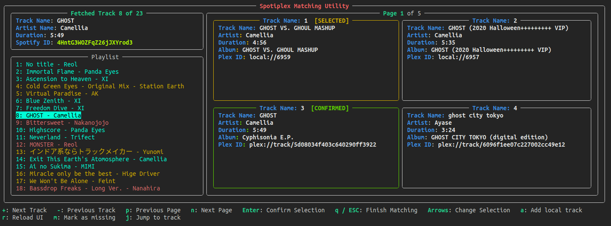

# spotiplex
Spotify Playlist sync for Plex



## Working

Spotiplex is a small program to help you sync your playlists from spotify and potentially other streaming services to plex.

It first uses the spotipy library to fetch the songs in a playlist and then checks with your plex instance for the tracks in the said playlist. After the scan the user is met with a matching utility where the user can manually confirm the matches made for the fetched tracks and then spotiplex searches for the tracks on deezer and youtube and then downloads them to the plex server. 

I was particularly looking for such a solution as I often ran into issues where I would end up downloading duplicate tracks and it was a pain tagging them and organizing my library. This might just ease up the process.

In the future I will look towards implementing support for other services too if possible.

## Installation

Install all the required modules present in `requirements.txt`

```sh
pip install -r requirements.txt
```

Create `credentials.py` in the current directory with the following text.

```py
plex_email = "PLEX_EMAIL"
plex_password = "PLEX_PASSWORD"
plex_server = "PLEX_SERVER_NAME"

spotify_client_id = "CLIENT_ID"
spotify_client_secret = "CLIENT_SECRET"

deemix_username =  'DEEMIX_USERNAME'
deemix_password = 'DEEMIX_PASSWORD'
```

Replace the following strings with your own credentials and then run `main.py`

### Devlog

**19th December 2022**
- Improved Matching Utility UI, replaced track control with playlist view along with track color coding
- More sensible track color coding
- Added track confirmation


**18th December 2022** 
- Spotiplex can take playlist IDs, fetch the songs and check if they are present in your plex installation or not.
- The matching utility can now display all the songs that have similar names and browser through them.